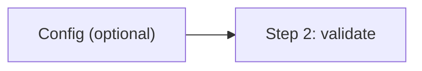
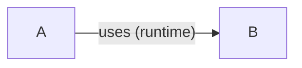
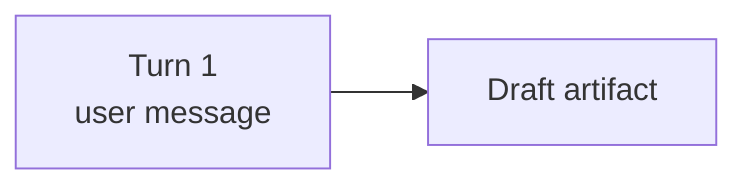
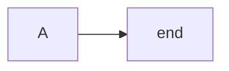

# md-validation

## 1. What This Skill Covers

Use Meridian's markdown validation commands:

- `meridian kg` for link analysis and document topology
- `meridian mermaid check` for Mermaid diagram validation

These tools work on any markdown file or directory target, not just Meridian knowledge-base content.

## 2. `meridian kg` Quick Stats

Run `meridian kg [path]` for a fast status pass.

It reports:

- file count
- link count
- broken link count

Use this as an immediate sanity check while editing docs.

## 3. `meridian kg graph` Link Topology

Run `meridian kg graph [path]` to see which documents link to which.

Targets:

- accepts a file path
- accepts a directory path

Common flags:

- `--depth N` link-hop depth (default `3`)
- `--external` include external URLs as leaf nodes
- `--exclude PATTERN` exclude matches by glob (repeatable)
- `--format json` machine-readable output

Persistent exclusions:

- add patterns to `.kgignore` at the scan root
- format is gitignore-style matching via `pathspec`

Tree markers to interpret:

- `(already shown)` node was previously rendered
- `(N links hidden)` links were truncated by depth/filters
- `(not found)` local target could not be resolved

Use this when joining a project or exploring unfamiliar docs before making structural changes.

## 4. `meridian kg check` Broken-Link Gate

Run `meridian kg check [path]` as a commit/CI gate for markdown links.

Flags:

- `--exclude PATTERN` exclude matches by glob (repeatable)
- `--format json` machine-readable output

Exit behavior:

- `0` no broken links
- `1` broken links found

Run before committing doc or KB updates.

## 5. `meridian mermaid check` Diagram Validation

Run `meridian mermaid check [path]` to validate Mermaid content in:

- fenced Mermaid blocks inside markdown files
- standalone `.mmd` files
- standalone `.mermaid` files

The command runs syntax validation AND default style warnings. Style warnings catch common authoring traps that are syntactically valid but produce surprising results (wrong edge types, unreadable text in dark/light mode, parser collisions).

### Flags

Core:

- `--depth N` directory traversal depth
- `--exclude PATTERN` exclude matches by glob (repeatable)
- `--format json` machine-readable output

Style control:

- `--strict` — warnings cause exit code 1 (default: warnings exit 0)
- `--no-style` — skip all style checks, syntax-only; wins over `--strict`
- `--disable cat1,cat2` — skip named warning categories

Persistent exclusions:

- `.mermaidignore` at the scan root

### Parser Modes

- Python heuristic parser by default
- optional JS strict parser when Node.js is available

### Default Warning Categories

| Category | Phase | Detects |
|----------|-------|---------|
| `ox-edge` | pre-parse | `---oNode` / `---xNode` parsed as circle/cross edge endings instead of node connections |
| `bare-end` | pre-parse | Bare lowercase `end` in flowcharts collides with subgraph terminator |
| `fill-no-color` | post-parse | Inline `style` with `fill:` but no `color:` — text unreadable across themes |

Pre-parse checks run on all blocks (even invalid ones — they detect traps that cause the syntax error). Post-parse checks run only on blocks that passed syntax validation. When a pre-parse warning and syntax error hit the same line, only the syntax error is shown.

`classDef` declarations do not trigger `fill-no-color` — only inline `style` directives. Categories like `inline-style` and `literal-newline` are reserved but not emitted by default.

### Inline Suppression

Suppress warnings inside Mermaid blocks with comments:

```
%% mermaid-check-ignore-next-line ox-edge
API ---oBackend

%% mermaid-check-ignore bare-end
```

- `%% mermaid-check-ignore-next-line <category>` — suppress one category on the next line
- `%% mermaid-check-ignore-next-line` — suppress all warnings on the next line
- `%% mermaid-check-ignore <category>` — suppress one category for the entire block
- `%% mermaid-check-ignore` — suppress all warnings for the entire block

### Warning Output Format

Text mode:

```
warning[ox-edge] docs/flow.md:12: edge `---oBackend` may be parsed as circle-edge ending
✓ 5 mermaid blocks valid; 1 style warning
```

JSON mode adds a `warnings` array alongside `results`, plus `total_warnings` and `suppressed_warnings` counts.

### Exit Behavior

- `0` — clean (warnings present but no `--strict`)
- `1` — syntax errors, or warnings with `--strict`
- `2` — target path not found

Run after diagram edits and during review of docs containing Mermaid.

## 6. Mermaid Authoring Rules

Keep diagrams readable in source and parseable by Mermaid. These rules prevent the most common syntax failures.

### Quoting Labels

Quote node labels that contain parser-sensitive punctuation — parentheses, brackets, angle brackets, commas, colons, emoji, or HTML:



Quote edge labels that contain punctuation or spaces around special terms:



When in doubt, quote. Missing quotes break the parse; unneeded quotes rarely cause issues.

### Line Breaks

Use `<br/>` for line breaks in traditional string labels (flowcharts, most diagram types):



Markdown-mode strings (`` "`text`" ``) use real newlines instead of `<br/>`. Sequence diagram messages support line breaks but behavior varies by renderer — test in your target environment. `\n` is not a recognized line-break sequence in Mermaid labels.

### Reserved Words and Ambiguous Identifiers

Bare lowercase `end` as a flowchart node label breaks the parser — it collides with the subgraph terminator. Use `End`, `END`, or quote the label:



Node IDs starting with `o` or `x` immediately after an edge marker are parsed as circle (`---o`) or cross (`---x`) edge endings. Add a space or capitalize:

```
A --- oNode       %% space prevents circle-edge parse
A --- xService    %% space prevents cross-edge parse
```

### Themes and Colors

Diagrams must render correctly in both light and dark mode. Default to renderer colors; add custom styling only for semantic emphasis.

**Priority chain** (prefer earlier options):

1. **Renderer defaults** — No styling. Nodes inherit the active theme's colors. Right choice for most diagrams.
2. **Init directive with `themeVariables`** — For global customization, use `%%{init: ...}%%` with `theme: base`. Respects renderer context better than per-node overrides:

   ```mermaid
   %%{init: {"theme": "base", "themeVariables": {"primaryColor": "#4a90d9", "primaryTextColor": "#1a1a2e"}}}%%
   flowchart LR
     A --> B --> C
   ```

3. **Stroke-only `classDef`** — For semantic emphasis on specific nodes. No fill means the node adapts to any background:

   ```mermaid
   flowchart LR
     classDef error stroke:#e74c3c,stroke-width:2px
     classDef active stroke:#2980b9,stroke-width:2px
     A --> B:::error --> C:::active
   ```

4. **Full `classDef` with fill** — Last resort. Set `fill`, `stroke`, and `color` together so text stays readable. Use mid-range tones that hold contrast on both light and dark backgrounds. Pair with labels — color alone is not accessible.

**General rules:**

- `classDef` over inline `style` — one class beats N scattered `style` lines.
- Keep classes sparse — accent semantic categories, not every node.
- Group `classDef` declarations at the top or bottom of the diagram.
- Built-in themes: `default`, `neutral`, `dark`, `forest`, `base`. Only `base` supports `themeVariables`.

## 7. When To Use Which Command

- Use `meridian kg check` before committing documentation changes to catch broken links.
- Use `meridian kg graph` to understand doc structure and link topology.
- Use `meridian mermaid check` when writing or reviewing docs with diagrams.

## 8. Minimal Validation Flow

1. `meridian kg [path]`
2. `meridian kg check [path]`
3. `meridian mermaid check [path]`
4. Fix issues and re-run until exit codes are clean

## 9. Reference

Use `meridian kg --help` and `meridian mermaid --help` for full option coverage.
