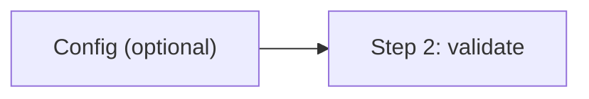
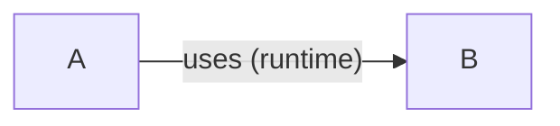
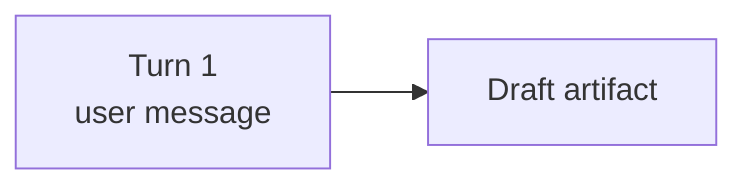
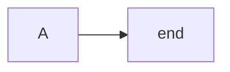

# Mermaid Authoring Rules

Keep diagrams readable in source and parseable by Mermaid. These rules prevent the most common syntax failures.

## Quoting Labels

Quote node labels that contain parser-sensitive punctuation — parentheses, brackets, angle brackets, commas, colons, emoji, or HTML:



Quote edge labels that contain punctuation or spaces around special terms:



When in doubt, quote. Missing quotes break the parse; unneeded quotes rarely cause issues.

## Line Breaks

Use `<br/>` for line breaks in traditional string labels (flowcharts, most diagram types):



Markdown-mode strings (`` "`text`" ``) use real newlines instead of `<br/>`. Sequence diagram messages support line breaks but behavior varies by renderer — test in your target environment. `\n` is not a recognized line-break sequence in Mermaid labels.

## Reserved Words and Ambiguous Identifiers

Bare lowercase `end` as a flowchart node label breaks the parser — it collides with the subgraph terminator. Use `End`, `END`, or quote the label:



Node IDs starting with `o` or `x` immediately after an edge marker are parsed as circle (`---o`) or cross (`---x`) edge endings. Add a space or capitalize:

```
A --- oNode       %% space prevents circle-edge parse
A --- xService    %% space prevents cross-edge parse
```

## Themes and Colors

Diagrams must render correctly in both light and dark mode. Default to renderer colors; add custom styling only for semantic emphasis.

**Priority chain** (prefer earlier options):

1. **Renderer defaults** — No styling. Nodes inherit the active theme's colors. Right choice for most diagrams.
2. **Init directive with `themeVariables`** — For global customization, use `%%{init: ...}%%` with `theme: base`. Respects renderer context better than per-node overrides:

   ```mermaid
   %%{init: {"theme": "base", "themeVariables": {"primaryColor": "#4a90d9", "primaryTextColor": "#1a1a2e"}}}%%
   flowchart LR
     A --> B --> C
   ```

3. **Stroke-only `classDef`** — For semantic emphasis on specific nodes. No fill means the node adapts to any background:

   ```mermaid
   flowchart LR
     classDef error stroke:#e74c3c,stroke-width:2px
     classDef active stroke:#2980b9,stroke-width:2px
     A --> B:::error --> C:::active
   ```

4. **Full `classDef` with fill** — Last resort. Set `fill`, `stroke`, and `color` together so text stays readable. Use mid-range tones that hold contrast on both light and dark backgrounds. Pair with labels — color alone is not accessible.

**General rules:**

- `classDef` over inline `style` — one class beats N scattered `style` lines.
- Keep classes sparse — accent semantic categories, not every node.
- Group `classDef` declarations at the top or bottom of the diagram.
- Built-in themes: `default`, `neutral`, `dark`, `forest`, `base`. Only `base` supports `themeVariables`.
